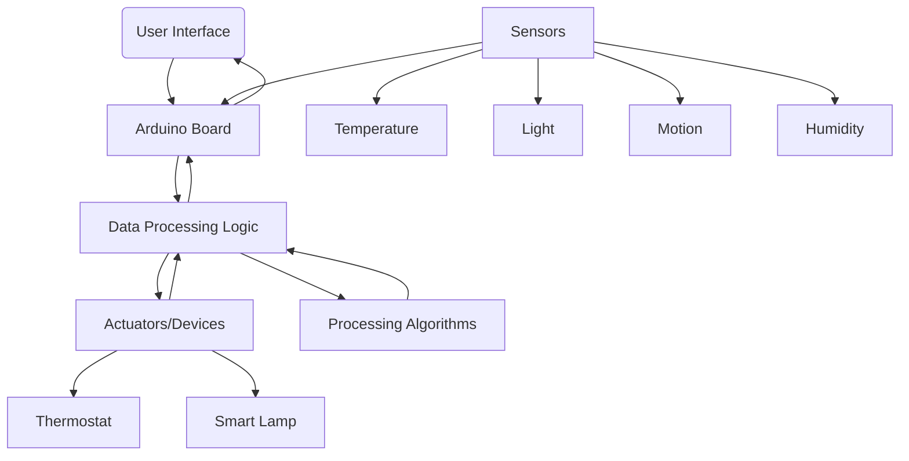

# Το πρόβλημα

Στόχος μας είναι να λύσουμε την πολυπλοκότητα των παραδοσιακών συστημάτων οικιακού αυτοματισμού. Οι χρήστες αντιμετωπίζουν σήμερα προκλήσεις με τη διαχείριση πολλαπλών συσκευών, διεπαφών και εφαρμογών, με αποτέλεσμα την κατακερματισμένη εμπειρία. Στόχος μας είναι να παρέχουμε μια κεντρική λύση που απλοποιεί τη διαχείριση των συσκευών, ενισχύει τον έλεγχο και βελτιώνει την αποτελεσματικότητα στον οικιακό αυτοματισμό.

# Υπάρχουσες προσεγγίσεις

- Alexa
- Google Home Assistand
- MI Smart Home

# Η δική μας προσέγγιση

Η προσέγγισή μας στον οικιακό αυτοματισμό με το Arduino επικεντρώνεται στην εφαρμογή "The Jon Zone". Απλοποιεί τα παραδοσιακά συστήματα οικιακού αυτοματισμού παρέχοντας μια κεντρική, φιλική προς το χρήστη λύση. Χρησιμοποιώντας το Arduino και συσκευές IoT, επιτρέπει τον απρόσκοπτο έλεγχο, τον εξατομικευμένο αυτοματισμό και τη βελτιστοποίηση της ενέργειας.

# Hardware

- Πλακέτα Arduino

- Συσκευές IoT: έξυπνα φώτα, έξυπνες πρίζες, έξυπνοι θερμοστάτες, έξυπνες κλειδαριές και άλλες συσκευές συμβατές με το Arduino.

- Αισθητήρες: αισθητήρες θερμοκρασίας, αισθητήρες κίνησης, αισθητήρες φωτός, αισθητήρες υγρασίας.

- Ενεργοποιητές: ηλεκτρονόμοι, σερβοκινητήρες.

# Αρχιτεκτονική

# Μεθοδολογία αξιολόγησης

# Δυσκολίες
