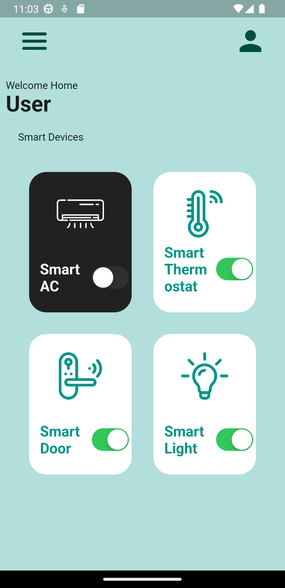
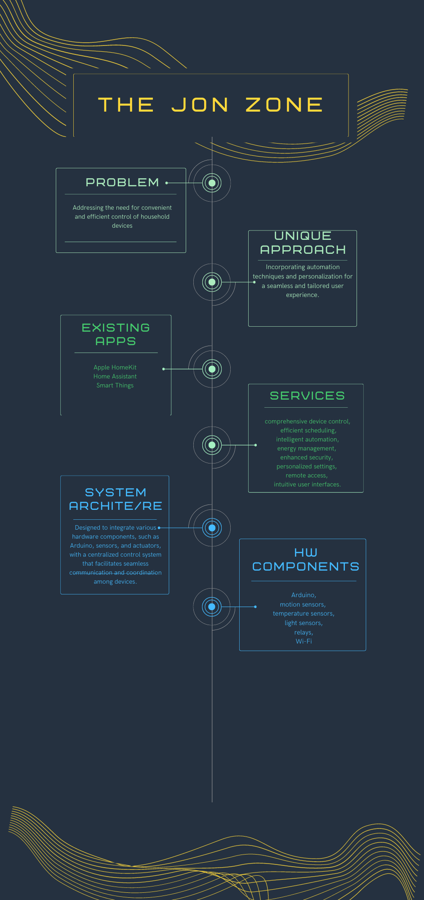

# The Jon Zone Home Automation Project

Welcome to "The Jon Zone" Home Automation Project! This project aims to provide a convenient and efficient solution for controlling and automating various household devices. 

- [The Jon Zone Home Automation Project](#the-jon-zone-home-automation-project)
- [Introduction](#introduction)
  - [Features](#features)
  - [User Interface](#user-interface)
  - [Infographic](#infographic)

# Introduction
"The Jon Zone" is a home automation project developed as part of Ionian University coursework. The goal of this project is to enhance convenience, energy efficiency, security, and customization in home automation.

## Features
- Device Control: Seamlessly control and manage various devices, such as lights, thermostats, media players, and more.
- Scheduling: Create schedules to automate device actions based on specific time or events.
- Intelligent Automation: Implement advanced automation techniques to enhance efficiency and user experience.
- Energy Management: Optimize energy usage and monitor consumption through intelligent controls.
- Enhanced Security: Integrate security features to protect homes and occupants.
- Personalized Settings: Tailor the automation system to individual preferences and requirements.
- Remote Access: Control and monitor devices remotely through mobile or web applications.
- Intuitive User Interfaces: Provide user-friendly interfaces for easy configuration and control.

## User Interface

## Infographic

